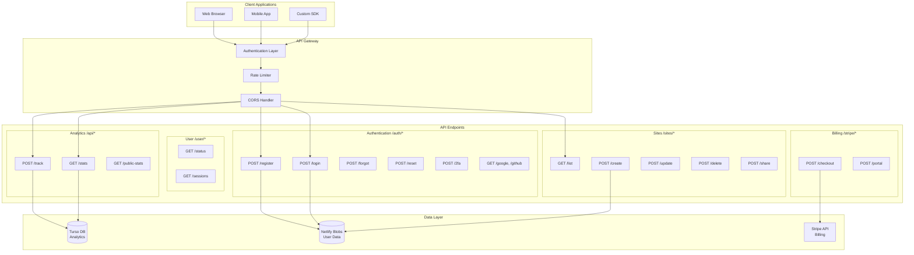
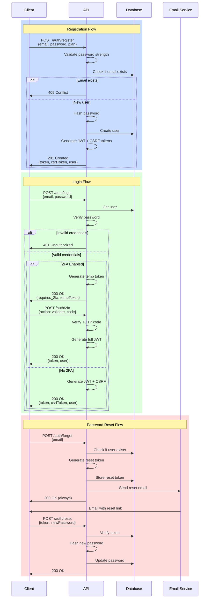
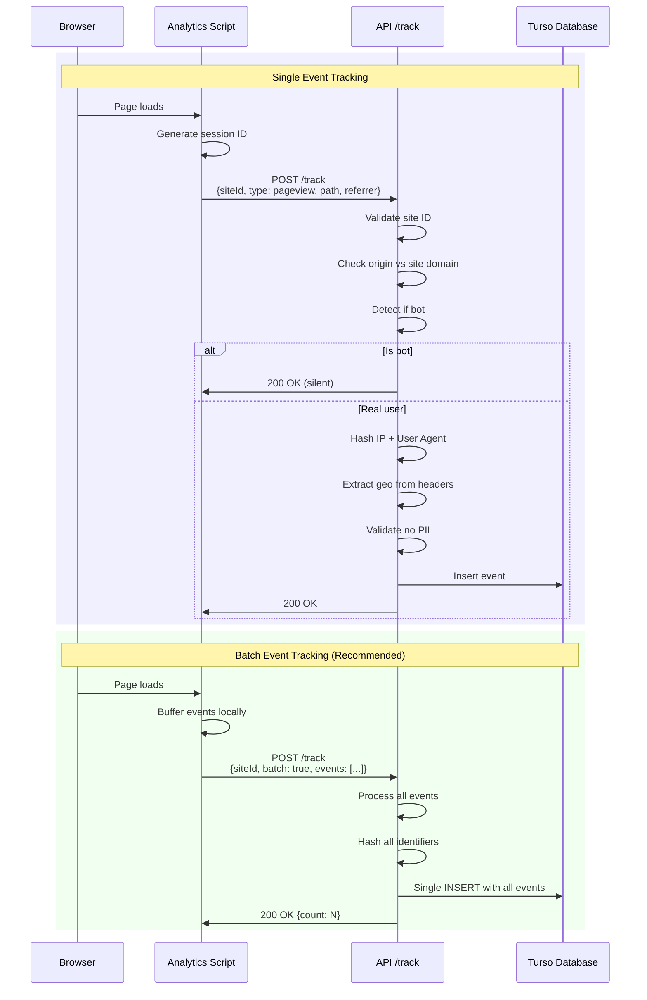
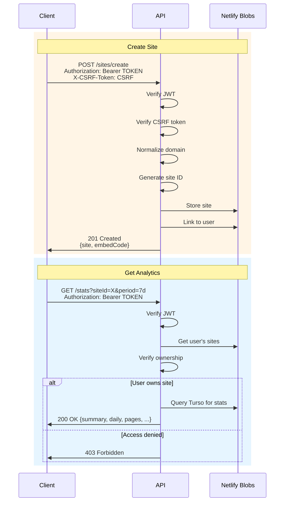
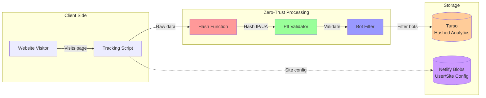
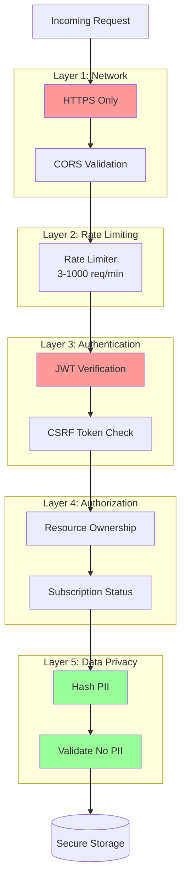
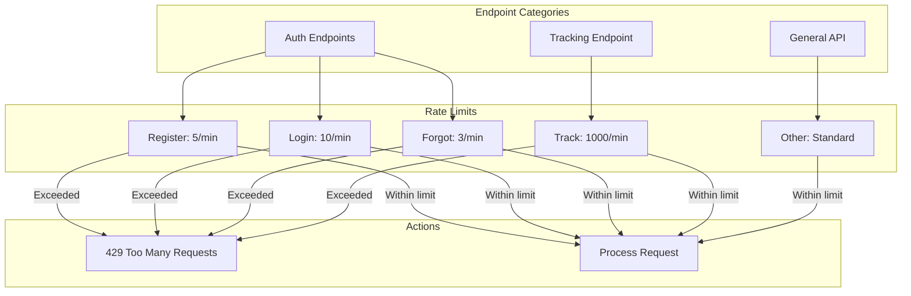
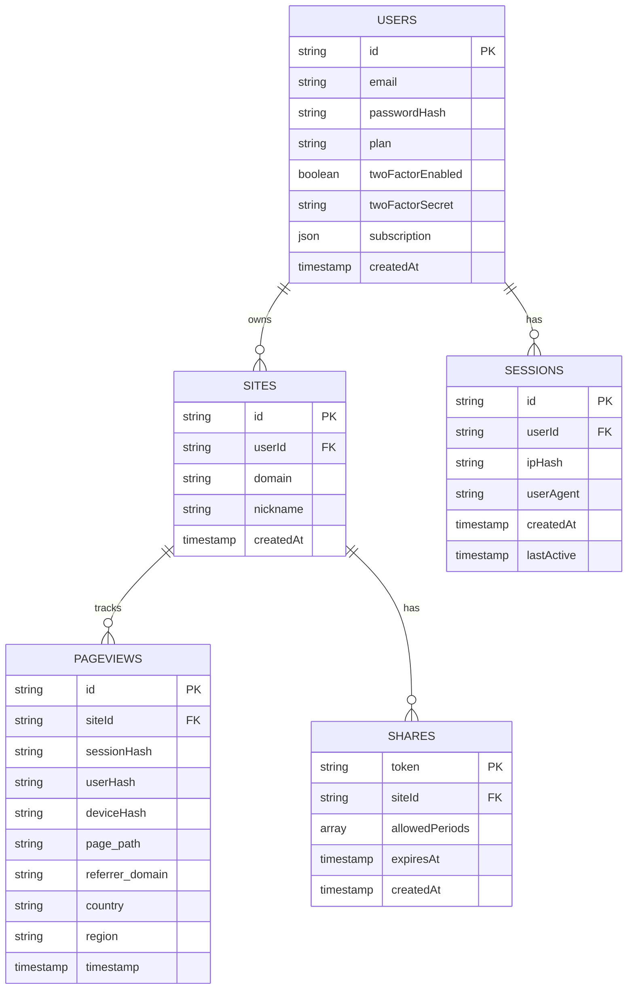
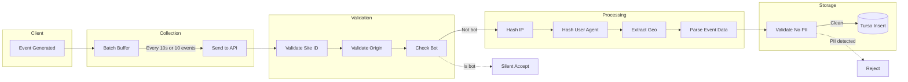
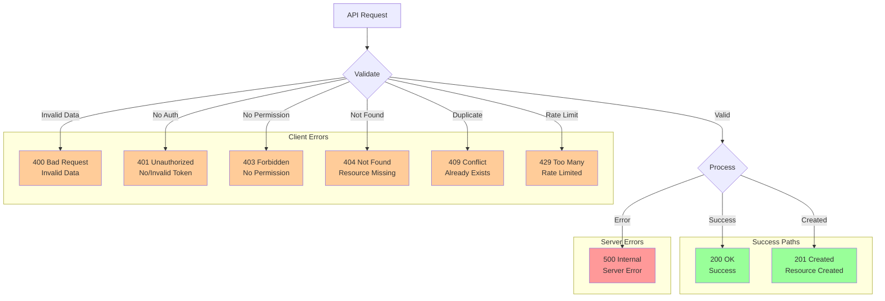

# Zero Trust Analytics API Architecture

## API Endpoint Structure

## Authentication Flow

## Analytics Tracking Flow

## Site Management Flow

## Data Flow Architecture

## Security Layers

## Rate Limiting Strategy

## Database Schema Overview

## Event Processing Pipeline

## API Response Flow

---

**Note**: These diagrams use Mermaid syntax and can be rendered in:
- GitHub (native support)
- VS Code (with Mermaid extension)
- Online viewers: https://mermaid.live/
- Documentation sites (GitBook, MkDocs, etc.)
